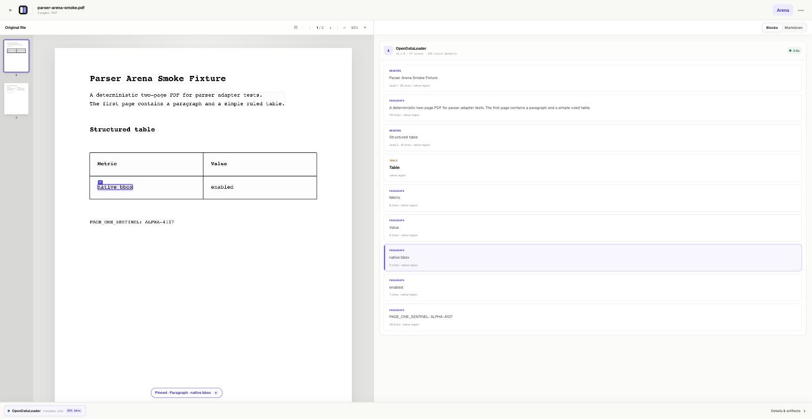

<h1 align="center">Parser Arena</h1>

<p align="center">
  <strong>See what your parser actually saw.</strong>
</p>
<p align="center">
  Upload a PDF, run open-source document parsers on your own machine, and inspect
  every result beside the source with parser-native bounding-box evidence.
</p>

<p align="center">
  
  
  
  
  
  
</p>

<p align="center">
  
</p>

---

Global leaderboards tell you which parser is best on average. They cannot tell
you which parser is best **for your document**. Parser Arena runs real parsers
in pinned containers, keeps their raw output untouched, and links every parsed
block back to the exact source region the parser reported — so you can judge
with evidence instead of vibes.

---

## Why Parser Arena

- **Evidence first.** Hover any parsed block and the parser-reported bounding
  box lights up on the original page. Only parser-native geometry is shown;
  nothing is inferred or invented. Blocks without geometry say so.
- **Reproducible by construction.** Every parser runs as a pinned OCI image
  with network disabled, raw JSON/Markdown preserved byte-for-byte, and a
  reproduction manifest (source hash, image digest, options, timing).
- **Your document, your machine.** The device-local path keeps the PDF in your
  browser and sends it straight to a local Docker runner. Nothing is uploaded
  to a server.
- **Honest failure.** A scanned PDF in a no-OCR profile fails with the real
  reason, not a fake result. Evidence coverage (share of blocks with native
  geometry) is shown on every run.

---

## Product surfaces

| Surface | What it does | Status |
|---|---|---|
| **Workspace** `/documents/[id]` | Upload → run a parser for real → Blocks / Markdown (rendered + raw) views, bidirectional evidence hover, image-region crops, resizable panes | Working prototype |
| **Arena** `/arena` | Blind battle: two anonymous results, listwise vote, reveal after voting | Simulated flow |
| **Leaderboard** `/leaderboard` | Per-document-type rankings from blind votes only | Device-local votes |

---

## Quick start

Requires [Node.js](https://nodejs.org) 24, [Bun](https://bun.sh) `>=1.3.10`,
GNU Make, and a running Docker engine.

```bash
# 1. Start the web app
make dev                # http://localhost:3000

# 2. In another terminal: build the parser image and start the local runner
make runner-serve       # http://localhost:8799

# 3. Upload a PDF at http://localhost:3000 and press "Run OpenDataLoader"
```

The PDF stays in your browser's IndexedDB and is posted directly to the local
runner; the parser executes in an isolated container (`--network none`,
read-only, non-root) and returns raw output plus a canonical document with
native bounding boxes.

### CLI smoke test

```bash
make parser-smoke
```

builds the pinned OpenDataLoader 2.5.0 image, parses a deterministic fixture,
and validates the result bundle (blocks, native regions, hashes). Output lands
in `work/runs/`.

---

## Parsers

| Parser | Profile | Status |
|---|---|---|
| [OpenDataLoader PDF](https://github.com/opendataloader-project/opendataloader-pdf) 2.5.0 | Deterministic digital-PDF, native element geometry, CPU | ✅ Runnable |
| [MinerU](https://github.com/opendatalab/MinerU) 3.4.4 | Pipeline profile, layout + OCR | ✅ Runnable |
| [Azure Document Intelligence](https://learn.microsoft.com/azure/ai-services/document-intelligence/) | prebuilt-layout, cloud OCR, strong on Korean · needs `AZURE_DI_*` in `.env` | ✅ Runnable (remote) |
| LightOnOCR, Docling, PaddleOCR, … | See the [parser landscape](docs/PARSER_LANDSCAPE.md) | Planned |

A parser integrates as a self-contained extension package — an OCI image, a
declarative `component.json` manifest, an options schema, and an adapter that
maps raw output to the canonical document. The core contains no
parser-specific code; see the
[pipeline component contract](docs/PIPELINE_COMPONENTS.md).

```text
extensions/opendataloader-pdf/
├── Dockerfile             pinned parser + runtime
├── component.json         role, capabilities, requirements
├── options.schema.json    options the UI renders generically
└── adapter/               raw output → canonical document + native bboxes
```

---

## Architecture

```text
Browser (PDF in IndexedDB, PDF.js viewer + evidence overlay)
   │  POST /v1/parse — the document never passes through the web control plane
   ▼
Local runner service (Bun, :8799)
   │  oci-batch/v1: mount input → run container → validate result bundle
   ▼
Parser container (pinned image · network none · read-only · non-root)
   │  raw JSON/MD (untouched) + canonical blocks + native bboxes
   ▼
Workspace: Blocks / Markdown views · evidence hover · coverage badge
```

Design decisions are logged one line at a time in [DECISIONS.md](DECISIONS.md).
The planned service architecture (BlobStore, durable orchestration, hosted
runners) is documented in [docs/](docs/) and intentionally not faked in the
running code.

---

## Roadmap

| Milestone | Scope |
|---|---|
| **M1** | Real upload → runner → result pipeline (local slice ✅), result persistence, contracts + fingerprint spec |
| **M2** | MinerU as the second parser; real two-parser comparison; catalog API |
| **M3** | Arena with real runs; blind listwise votes with recorded permutations |
| **M4** | Leaderboard from blind votes; hosted CPU parsing; stage-level caching |
| Later | LLM postprocessor slots, LLM Judge validated against human votes, GPU/BYO runners |

Full planning documents:

- [Product plan](docs/PRODUCT_PLAN.md) ·
  [Pages and user scenarios](docs/PAGES.md) ·
  [Core features](docs/CORE_FEATURES.md)
- [Architecture](docs/ARCHITECTURE.md) ·
  [Workflows](docs/WORKFLOWS.md) ·
  [Pipeline components](docs/PIPELINE_COMPONENTS.md) ·
  [Storage and rendering](docs/STORAGE_AND_RENDERING.md)
- [Parser landscape](docs/PARSER_LANDSCAPE.md) ·
  [Evaluation design](docs/EVALUATION.md) ·
  [Research and idea backlog](docs/RESEARCH_IDEAS.md)
- [Containers](docs/CONTAINERS.md) ·
  [Cloud runner](docs/CLOUD_RUNNER.md)

---

## Repository layout

```text
app/                   Web app (Next.js App Router) and comparison UI
services/runner/       Generic OCI batch runner + local runner HTTP service
packages/contracts/    Artifact, component, catalog, and result schemas
extensions/            Self-contained parser packages (one directory per parser)
infra/                 Compose and deployment configuration
docs/                  Product, architecture, and evaluation decisions
fixtures/              Redistributable test PDFs
tests/                 Bun test suite (SSR, contracts, runner bundle, mapping)
```

Parser binaries, uploaded documents, generated outputs, model weights, API
keys, and benchmark datasets are never committed.

---

## Development

```bash
make dev            # host HMR dev server
make check          # production build + tests + lint
make parser-smoke   # end-to-end parser run in Docker
make runner-serve   # local runner service for the web app
make help           # everything else
```

JavaScript/TypeScript uses Bun exclusively; Python extensions own a
uv-managed `pyproject.toml`. The Compose stack (`make up`) contains only
runnable services — planned infrastructure is documented, not stubbed.

The browser and short-lived control-plane routes use the official Next.js
runtime and can deploy to Vercel or another compatible Node/Docker host.
Durable orchestration and OCI parser execution are separate backend services;
web routes do not execute parser containers or proxy uploaded PDF bodies.

---

## Contributing

The most valuable contribution is a parser adapter. The bar: a new parser must
integrate through an extension package alone — if it needs a change in the
runner, API, or UI, that is a bug in our contract and we want to know. Start
from `extensions/opendataloader-pdf/` as the reference, and open an issue with
the parser and profile you have in mind.

Bug reports with a specific PDF and a wrong parse are equally welcome; that
is exactly what this tool exists to surface.

---

## License

Not yet decided; until a root license lands, this repository should not be
treated as a licensed redistributable release. Each extension documents the
licenses of the parser it packages in its own `LICENSES.md`.
