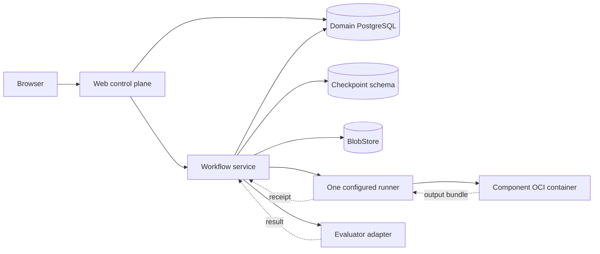

# Parser Arena architecture

Status: accepted minimal core  
Date: 2026-07-15

## Architectural goal

The product should feel like a parser comparison tool, while the execution core
is general enough to compose preprocessing, parsing, LLM enrichment, chunking,
embedding, and vector storage later.

The user-facing product and component runtime are not a workflow builder. They
support one typed linear recipe:

```text
source
  → preprocess* → parser → postprocess* → chunk? → embed? → vector sink?
```

Only the parser slot is required. There are no user-authored branches, loops,
conditions, or visual graph editor. Evaluation is a separate read-only job that
consumes the source and selected artifacts without changing them.

Long-running ingest, pipeline, and evaluation jobs run inside a thin LangGraph
durability envelope. That envelope owns execution sequencing and resume points;
it does not change the recipe model or leak into component contracts. See
[Durable workflow orchestration](WORKFLOWS.md).

See [Pipeline and component contract](PIPELINE_COMPONENTS.md).

## Small system boundary



- The web application handles uploads, workspaces, run requests, and comparison
  UI; it never runs parser code.
- The workflow service leases durable jobs, invokes the shared LangGraph
  envelope, and updates authoritative domain records.
- The runner executes generic component contracts and knows no parser names.
- Components own parser-specific invocation and canonical conversion.
- Metadata and large artifacts are separated behind small storage interfaces.
- A hosted deployment chooses its runner automatically. A self-hosted Docker
  deployment uses the same API locally.

MVP has one configured runner, a PostgreSQL-backed job lease/outbox, and
domain-event polling. LangGraph checkpoints do not replace the queue lease,
cancellation, or public event log. Runner registries, multi-region scheduling,
signed catalogs, and persistent parser services are later concerns.

## Hosted deployment boundary

The first hosted target splits the web surface from durable execution:

- Vercel runs the official Next.js application, authentication, workspace
  reads, signed upload creation, job submission, and short status APIs.
- The browser uploads PDF bytes directly to R2 with a short-lived signed URL;
  the Next.js application does not proxy document bodies.
- A separately deployed workflow service owns durable job leases and the thin
  LangGraph lifecycle envelope.
- A private runner host executes the generic OCI contract and launches parser
  containers. It is never embedded in or publicly exposed by the web service.
- Managed PostgreSQL remains authoritative for product and job state, while R2
  is reached only through the provider-neutral `BlobStore` contract.

This is one product API and one user flow, not a user-visible infrastructure
choice. A small initial deployment may colocate the workflow service and runner
on one Docker VM while keeping their application boundaries separate.

## Repository shape

```text
app/                    Upload, workspace, comparison, and API routes
services/orchestrator/  Thin workflow entrypoints, job dispatch, and tasks
services/runner/        Recipe validation and generic stage execution
packages/contracts/     Artifact, component, recipe, run, and result schemas
extensions/<id>/        Component manifest, adapter/profile, and fixture
infra/                  Docker Compose and deployment configuration
docs/
fixtures/               Small redistributable PDFs
```

All extension kinds share one package shape. A parser is the first component
kind, not a special dependency imported by the runner.

## Minimal API

```text
GET    /v1/health
GET    /v1/components
GET    /v1/recipes
POST   /v1/documents
POST   /v1/documents/{documentId}/upload-complete
GET    /v1/documents/{documentId}
DELETE /v1/documents/{documentId}
POST   /v1/documents/{documentId}/runs
GET    /v1/runs/{runId}
POST   /v1/runs/{runId}/cancel
POST   /v1/documents/{documentId}/evaluations
GET    /v1/evaluations/{evaluationRunId}
GET    /v1/jobs/{jobId}/events?afterSeq={seq}
```

The run request normally contains only a `recipeId`. Advanced clients may
override schema-validated component options. The deployment resolves the runner
and secrets; first-time users do not choose CPU/GPU targets or endpoints.
All GET status and workspace responses are projections of authoritative domain
records; they never expose or depend on LangGraph checkpoint data.

## Domain model

```text
DocumentWorkspace
 ├─ SourceDocument
 ├─ PipelineRun[]
 │   ├─ resolved recipe and recipe hash
 │   ├─ StageRun[]
 │   ├─ parserOutput: ArtifactRef
 │   ├─ finalOutput: ArtifactRef
 │   └─ indexReceipt?: ArtifactRef
 └─ EvaluationRun[]

StageRun
 ├─ component revision and resolved options
 ├─ input ArtifactRef[]
 ├─ output ArtifactRef[]
 ├─ StageAttempt[]
 ├─ status, timestamps, error, and resource summary
 └─ raw artifacts and logs

Job
 ├─ kind: ingest | pipeline | evaluation | cleanup
 ├─ owner-scoped idempotency key
 ├─ status and lease
 ├─ JobEvent[] with monotonic sequence
 └─ workflow thread id? (ingest, pipeline, evaluation only)
```

The UI may call a `PipelineRun` a “parser run.” Keeping the internal model
generic lets a later run reuse one parser result with a different LLM or vector
store without parsing the document again.

The API treats execution as at-least-once. A technical retry with the same
resolved recipe creates a new `StageAttempt` under the same logical run. A
component, option, image, model, or prompt change creates a new `PipelineRun`.
Cancellation moves through `cancel_requested -> cancelling -> cancelled` and
the runner must stop the actual OCI process; a graph interrupt alone is not
cancellation.

## Immutable artifacts and lineage

Every stage reads immutable artifact references and writes new artifacts. It
never edits its input.

```text
ArtifactRef
  id
  type                 source-document, pdf-metadata, page-render-set,
                       parsed-document, chunk-set, embedding-set, index-receipt
  schemaVersion
  contentHash
  size
  createdByStageRun
  derivedFrom[]
  storageRef
```

This gives three useful properties without implementing a DAG:

- the raw parser result and an LLM-cleaned result remain separately inspectable;
- a later postprocessor can start from an existing parser artifact;
- stage caching can eventually key on input hashes, component revision, and
  resolved options.

Durable records store logical artifact ids, never host paths or expiring URLs.
`storageRef` is a provider-neutral bucket/key reference, never a public provider
URL.

## Minimal canonical parser result

The first schema should support the comparison UI, not every future metric.

```text
ParsedDocument
  documentText?
  markdown?
  pages[]
    pageNumber, width, height
    blocks[]
      id, kind, text?, markdown?, html?, latex?
      readingOrder?
      sourceRegions[]?
        pageNumber
        bbox? or polygon?
        provenance: native
        nativeRef
      rawArtifactRef
  rawArtifactRefs[]
```

Coordinates use normalized top-left page space. Parser-native coordinates and
reversible conversion details remain in `nativeRef` and raw metadata.
`provenance` here describes geometry only and is always `native` in the MVP.
Artifact derivation is represented separately by `ArtifactRef.derivedFrom`.
Unsupported structure stays absent; the adapter must not invent geometry.

MVP hover uses native parser geometry only. Text alignment, split/merge mapping,
table-cell normalization, and manual mapping can extend the schema later without
blocking the first vertical slice.

## Execution contract

MVP implements only `oci-batch/v1`:

```text
/arena/request.json          read-only
/arena/input/                read-only artifact materialization
/arena/output/               writable result bundle
```

The result bundle contains a primary typed artifact, untouched raw outputs, a
small run manifest, and structured failure information. An HTTP service
protocol may be added only after measured model-startup cost justifies it.

The workflow calls the runner through idempotent submit and await tasks. Submit
returns a stable `runnerJobId`; the workflow validates the returned bundle and
publishes artifacts through `BlobStore` only after success.

Components are isolated with time, memory, process, disk, and optional GPU
limits. Network and secret access are opt-in declarations. LLM and vector-store
credentials are referenced through named connections and are never written to
recipes, artifacts, logs, or exports.

## Comparison and evaluation boundary

Parser comparison defaults to each run's `parserOutput`, before LLM enrichment.
Derived outputs are selectable only with a visible recipe label such as
“MinerU + cleanup model.” This prevents a postprocessor from silently improving
a parser's score.

An `EvaluationRun` receives the source plus two or more selected artifacts. It
may produce automatic metrics or an LLM Judge result, but it cannot mutate any
candidate. The MVP Judge is one anonymized, randomized listwise pass with ties;
advanced aggregation remains research work. Each evaluation has its own
job-scoped workflow and can fail or retry without changing parser runs.

## Persistence

The code keeps three persistence roles separate:

- authoritative PostgreSQL domain tables for workspaces, jobs, attempts, events,
  stage status, and artifact indexes;
- a `BlobStore` for PDFs, optional page images, raw output, and canonical
  results;
- a separate LangGraph checkpoint schema containing rebuildable execution
  cursors only.

Minimal unit development may use SQLite, SqliteSaver, and a local directory.
The reference Docker deployment uses one PostgreSQL cluster with separate
domain/checkpoint schemas plus SeaweedFS. The hosted service uses PostgreSQL
plus R2. It does not combine D1 with PostgreSQL merely for checkpointing.

Provider details and render behavior are defined in
[Storage, rendering, and native geometry](STORAGE_AND_RENDERING.md).

## Minimal reproducibility record

Each stage records:

- source and input artifact hashes;
- component and upstream tool/model revisions;
- image digest;
- resolved non-secret options and prompt revision;
- start/end time, status, and error;
- coarse hardware class and cache mode where relevant.

Detailed driver telemetry, cost accounting, signed catalogs, and full resource
profiling are valuable later, but are not launch blockers.

## Security baseline

- Validate file type, size, and page limits before execution.
- Treat filenames as labels, not paths.
- Run untrusted document code without host credentials or Docker socket access.
- Default component networking to off; declare required external connections.
- Never log document text or secret values by default.
- Show when a stage sends document content to an external LLM or vector store.
- Tombstone before deletion, cancel active work, then purge source, derived
  artifacts, events, and checkpoints through a retryable cleanup receipt.

## Expansion test

The boundary is successful when a new component can be added through one
`extensions/<id>/` package and a recipe change, with no component-id branches in
the runner, database, evaluator, or UI. The first test after two real parsers is
a fixture postprocessor that creates a derived artifact without rerunning the
parser.
